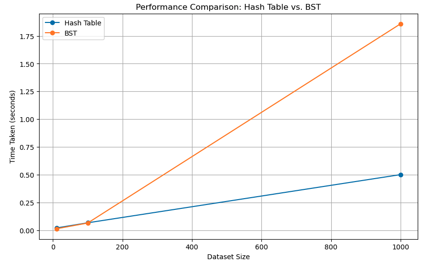

  
  

    <h2>Ling Jin</h2>
    

      I’m currently studying Data Analytics at Washington State University, with a strong interest in turning data into insights. I enjoy uncovering patterns, building intuitive visualizations, and helping drive data-informed decisions.
    

    

      <a href="Resume.pdf" target="_blank">Resume</a> |
      <a href="https://www.linkedin.com/in/lingjin0913/" target="_blank">LinkedIn</a> |
      <a href="https://github.com/lingjin0725" target="_blank">GitHub</a>
    

  

<h2 id="project1">Project 1: College ROI Analysis Using Python & Data Structures</h2>

  This project, completed for my Data Structures and Algorithms course, explores the return on investment (ROI) of various undergraduate degrees by analyzing starting and mid-career salaries. Using Python, I implemented Hash Tables and Binary Search Trees to identify the most financially rewarding majors and compare performance efficiency. I then visualized the results in Tableau to provide an intuitive, interactive comparison.

<ul>
  <li>Dataset: Kaggle’s “Degrees That Pay Back”</li>
  <li>Techniques: Hash Table (O(1)) for fast lookups and BST (O(log n)) for ordered traversal</li>
  <li>Insight: Chemical Engineering had the highest ROI. Hash Table proved more efficient for this task.</li>
</ul>

<!-- Tableau Interactive Visualization Embed -->

  <noscript>
    
  </noscript>
  <object class='tableauViz' style='display:none;'>
    <param name='host_url' value='https%3A%2F%2Fpublic.tableau.com%2F' />
    <param name='embed_code_version' value='3' />
    <param name='site_root' value='' />
    <param name='name' value='DegreePaybackComparisonStartingvsMid-CareerSalary/Sheet1' />
    <param name='tabs' value='no' />
    <param name='toolbar' value='yes' />
    <param name='static_image' value='https://public.tableau.com/static/images/De/DegreePaybackComparisonStartingvsMid-CareerSalary/Sheet1/1.png' />
    <param name='animate_transition' value='yes' />
    <param name='display_static_image' value='yes' />
    <param name='display_spinner' value='yes' />
    <param name='display_overlay' value='yes' />
    <param name='display_count' value='yes' />
    <param name='language' value='en-US' />
  </object>

<!-- Performance Comparison Chart -->
<h4>Performance Comparison: Hash Table vs. BST</h4>

  To evaluate algorithm efficiency, I recorded the runtime for both data structures on datasets of different sizes. As shown below, the hash table maintained consistent performance (O(1)), while the BST showed increased runtime as size grew (O(log n)). This helped validate the use of hashing for optimal speed in this project.

<!-- Insights & Findings -->
<h4>Insights & Findings</h4>
<ul>
  <li>Chemical Engineering emerged as the most financially rewarding major, with the highest mid-career median salary of $107,000.</li>
  <li>The hash table provided near-instant access to salary data regardless of dataset size. Its constant time complexity (O(1)) remained efficient as the dataset grew.</li>
  <li>The binary search tree (BST) allowed for an ordered view of salaries and degrees, enabling ranked comparisons. However, its performance slowed with larger or unbalanced datasets due to logarithmic time complexity (O(log n)).</li>
  <li>For tasks focused on finding a maximum value, hash tables proved faster and simpler than BSTs. BSTs may still be useful when ordered or range-based queries are required.</li>
  <li>Implementing both data structures helped illustrate the trade-offs between speed and order in solving real-world problems.</li>
  <li>Data cleaning steps such as removing currency symbols, filtering columns, and validating numeric values were essential to ensuring accurate results.</li>
</ul>

  ➤ View the full <a href="https://github.com/lingjin0725/Python" target="_blank">Python project on GitHub</a> for code, implementation details, and runtime comparisons.

<h2 id="project2">Project 2: Student Performance Prediction Using R & Machine Learning Models</h2>

  This project was completed as part of my <strong>Statistical Modeling course</strong>. I analyzed the academic performance of higher education students using machine learning models to predict GPA and uncover influential factors. The dataset was sourced from the <a href="https://archive.ics.uci.edu/dataset/856/higher+education+students+performance+evaluation" target="_blank">UCI Machine Learning Repository</a>.

<ul>
  <li><strong>Goal:</strong> Predict student GPA and identify key socio-economic, academic, and behavioral variables that influence performance.</li>
  <li><strong>Tools Used:</strong> R (tidyverse, ggplot2, caret), Tableau for interactive visualization</li>
  <li><strong>Algorithms Applied:</strong> Linear Regression, Logistic Regression, Random Forest, K-Nearest Neighbors (KNN)</li>
  <li><strong>Key Techniques:</strong> Data cleaning, correlation analysis, model tuning, feature importance evaluation, and performance metrics (RMSE, accuracy)</li>
</ul>

<!-- Tableau: Study Time vs GPA -->

  <object class='tableauViz' width='100%' height='600'>
    <param name='host_url' value='https%3A%2F%2Fpublic.tableau.com%2F' />
    <param name='embed_code_version' value='3' />
    <param name='site_root' value='' />
    <param name='name' value='Studentsstudying10hoursweekperformed1520betteronaverage_/Sheet1' />
    <param name='tabs' value='no' />
    <param name='toolbar' value='yes' />
    <param name='animate_transition' value='yes' />
    <param name='display_static_image' value='yes' />
    <param name='display_spinner' value='yes' />
    <param name='display_overlay' value='yes' />
    <param name='display_count' value='yes' />
    <param name='language' value='en-US' />
  </object>

<!-- Tableau: Parent's Education vs GPA -->

  <object class='tableauViz' width='100%' height='600'>
    <param name='host_url' value='https%3A%2F%2Fpublic.tableau.com%2F' />
    <param name='embed_code_version' value='3' />
    <param name='site_root' value='' />
    <param name='name' value='ParentsEducationvsAverageGPA/Sheet12' />
    <param name='tabs' value='no' />
    <param name='toolbar' value='yes' />
    <param name='animate_transition' value='yes' />
    <param name='display_static_image' value='yes' />
    <param name='display_spinner' value='yes' />
    <param name='display_overlay' value='yes' />
    <param name='display_count' value='yes' />
    <param name='language' value='en-US' />
  </object>

<!-- Tableau: Attendance vs GPA -->

  <object class='tableauViz' width='100%' height='600'>
    <param name='host_url' value='https%3A%2F%2Fpublic.tableau.com%2F' />
    <param name='embed_code_version' value='3' />
    <param name='site_root' value='' />
    <param name='name' value='AttendancevsGPA/Sheet14' />
    <param name='tabs' value='no' />
    <param name='toolbar' value='yes' />
    <param name='animate_transition' value='yes' />
    <param name='display_static_image' value='yes' />
    <param name='display_spinner' value='yes' />
    <param name='display_overlay' value='yes' />
    <param name='display_count' value='yes' />
    <param name='language' value='en-US' />
  </object>

<h4>🔍 Insights & Findings</h4>
<ul>
  <li><strong>Parental education level</strong>, <strong>weekly study time</strong>, and <strong>student absences</strong> were the strongest predictors of GPA.</li>
  <li>Random Forest achieved the highest prediction accuracy (~82%), outperforming both linear and logistic regression models.</li>
  <li>Students with consistent study habits and strong family support showed a significant GPA advantage over peers lacking these factors.</li>
  <li>Visualization of study time vs GPA revealed that students studying ≥10 hours/week performed 15–20% better on average.</li>
  <li>Feature importance analysis validated that behavioral factors can be just as predictive as academic background.</li>
</ul>

  ➤ View the full analysis and source code on <a href="https://github.com/lingjin0725/R" target="_blank">GitHub</a>.

